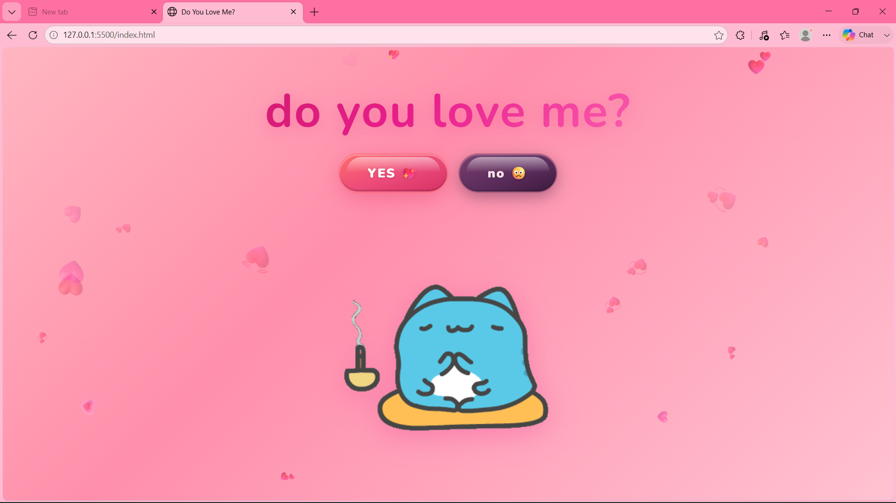
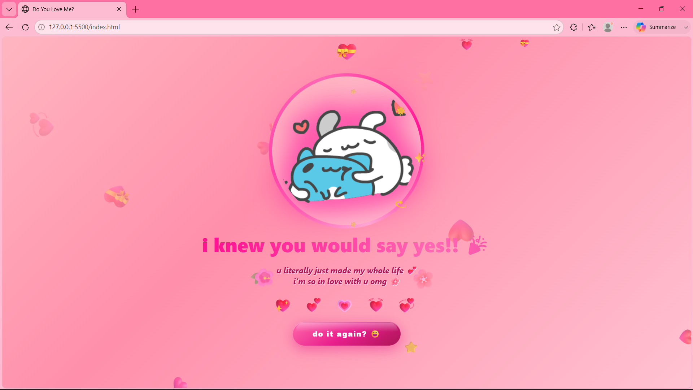

# 💖 do you love me?

> a website where saying **NO** is simply not an option.




---

## 🤔 what is this?

so basically... i made a webpage that asks one very important question.

you get two buttons. **YES** and **no**.

sounds fair right?

**WRONG.** 💀

every time you click NO, the YES button gets bigger. and bigger. and BIGGER.
until it literally takes over your entire screen and you have no choice but to click it.

the NO button? it gets smaller. and sadder. and slowly disappears into the void.

justice. 💅

---

## ✨ features

- 🐱 a cat gif that reacts to everything you do
- 💖 YES button that grows aggressively with every NO
- 😭 NO button that slowly gives up on life
- 🎆 a dramatic happy ending when you finally say yes
- 💌 floating hearts because why not
- 📱 works on mobile too (the chaos translates well)

---

## 📂 files

```
do-you-love-me/
├── index.html       ← the main crime scene
├── styles.css       ← making it pretty
├── script.js        ← the manipulation engine
├── hm.gif           ← cat being normal
├── yyes.gif         ← cat gets excited
├── nno.gif          ← cat is disappointed in you
└── llove.gif        ← cat celebrates your good decision
```

---

## 🚀 how to run

1. clone or download this repo
2. open `index.html` in your browser
3. try to click NO
4. fail
5. click YES
6. 🎉

---

## 🛠️ built with

- HTML
- CSS
- JavaScript
- emotional manipulation
- a little bit of chaos

---

## 💌 the verdict

you were never going to say no anyway.

we both knew that. 🥺

---

*made with love (and zero chill)* 💖
